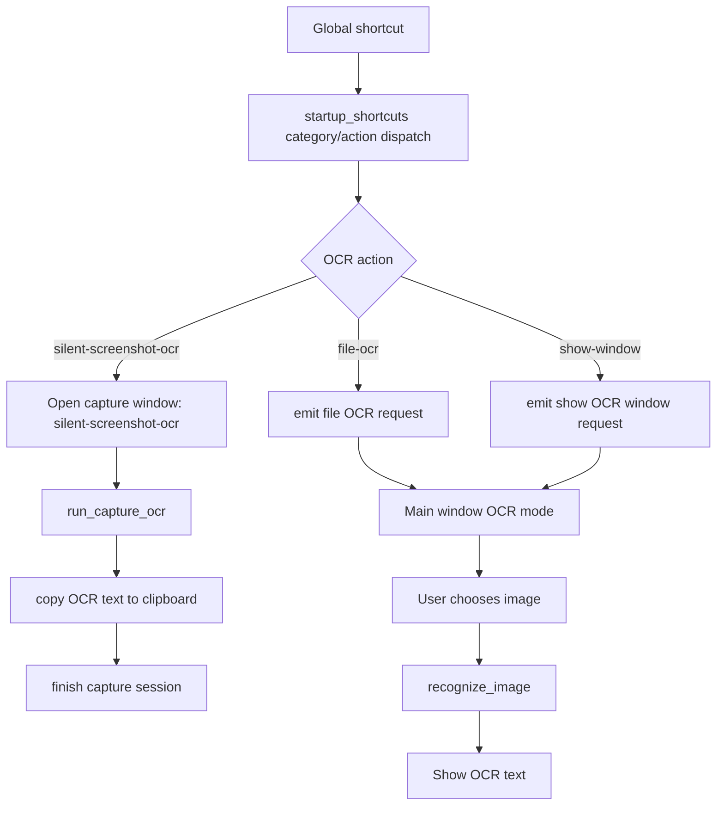

# OCR Hotkey Workflows Design

## Goal

Implement the OCR hotkey actions that are currently registered as known-but-unimplemented:

- `ocr:silent-screenshot-ocr`
- `ocr:file-ocr`
- `ocr:show-window`

The workflows should reuse the existing capture session runtime and OCR coordinator instead of creating a separate OCR pipeline.

## Assumptions

- `show-window` opens an OCR result/upload window in the main app, not the OCR settings history page.
- `show-window` lets the user upload an image and run OCR from that window.
- `file-ocr` opens an image picker directly from the shortcut and shows the OCR result in OCR mode.
- `silent-screenshot-ocr` uses the existing region selection capture flow, then copies recognized text to the clipboard without opening the result window.

## Architecture

OCR hotkeys remain category/action mappings in `src-tauri/src/startup_shortcuts.rs`. That module should only register global shortcuts and dispatch high-level workflow commands or events.

Screenshot-based OCR continues to use Capture Session:

1. Shortcut dispatch opens the capture window in a capture mode.
2. The frontend capture session asks the backend to recognize selected image content.
3. Completion behavior is derived from the mode: show OCR window, show translation window, or copy silently.
4. The capture session restores hidden windows and exits.

File-based OCR should live in frontend workflow glue:

1. Shortcut dispatch emits an OCR window/file event to the main window.
2. The main window opens OCR mode.
3. The frontend uses Tauri dialog/fs APIs to select and read an image file.
4. The existing `recognize_image` command sends bytes to `OcrCoordinator`.
5. OCR text is shown in OCR result mode.

Result presentation becomes explicit:

- `translation` mode keeps the current translation UI and auto-translate flow.
- `ocr` mode shows recognized text and an upload action.
- Store state owns the current result window mode, source text, OCR status, and OCR error.

## Data Flow

## Error Handling

- Capture OCR failures stay inside the capture window error state.
- Silent OCR copy failures are shown as capture errors and keep the session recoverable.
- File picker cancellation is a no-op.
- File read and OCR provider failures are shown inside the OCR result window.
- Empty OCR output is still displayed as an empty result, not treated as an infrastructure failure.

## Testing

- Frontend unit tests cover result window mode transitions and OCR file workflow helpers.
- Capture interaction tests cover `silent-screenshot-ocr` completion as silent copy.
- Rust unit tests cover startup shortcut implementation gating and dispatch registration.
- Existing integration/build checks remain the final guard: `npm test`, `npm run build`, `cargo test --manifest-path src-tauri/Cargo.toml --lib`, and `cargo test --manifest-path src-tauri/Cargo.toml --tests`.
